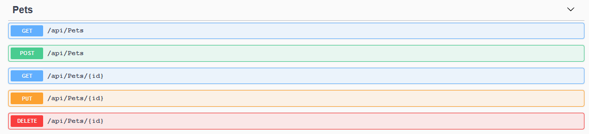
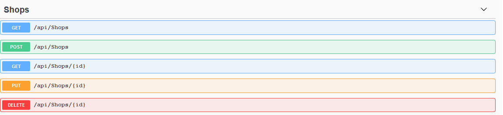
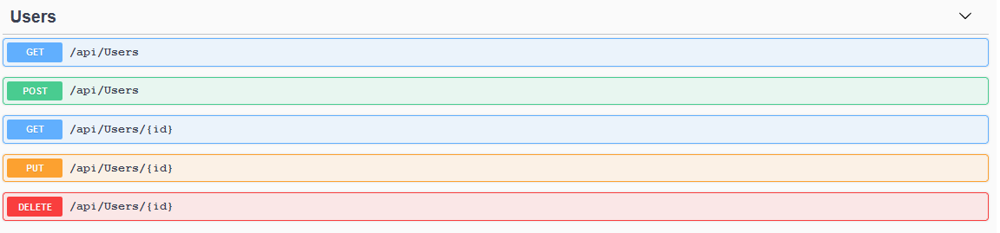
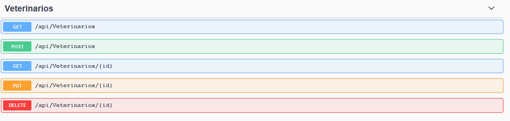

# WebApiPet
Web Api para PetShops e Clinicas Veterinarias 

Web Api for PetShops and Vet's
# Sobre -- About
Rest Api criada com entity frame work core no asp net core 5, docker está habilitado mas ainda não subi o postgree dentro dele então ele está buscando a instancia fora do docker. sugiro utilizar por fora por hora. 

Rest Api created with entity framework core, on the asp.net core 5, has Docker support but i'm do not put postgress sql in docker conteinar. i suggest do a out instance by now.
# Routes 

I decide to use "Shops" to refer a Pet Shops and Vet Clinic's

